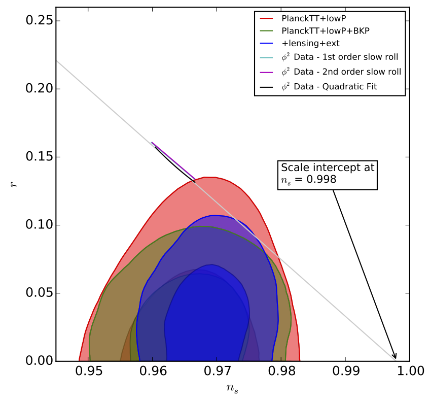

# MPhys Final Year Project Work
This is a record of my final year project for my MPhys Physics degree. In this, I wrote Python code that numerically solves the inflation equations of motion in terms of the Mukhanov-Sasaki variable for both the background (BackgroundSolver directory) and the field perturbations (PerturbationSolver directory). I tested this on three different models of inflation:

  * Quadratic inflation
  * Quartic inflation
  * Axion monodromy inflation

I then used the code's solutions for the ODEs to extrapolate measuremnents for *ns* and *r* from each model which were then compared to the latest constraints given from Planck2015 data. I was able to confirm which models were more suitable based on the results from my code and wrote the MPhys thesis given in the report directory.

**Figure:** *The r vs. ns plot for the quadratic inflation model with the Planck 2015 constraints on each parameter included. See Images directory for examples for the other models.*
